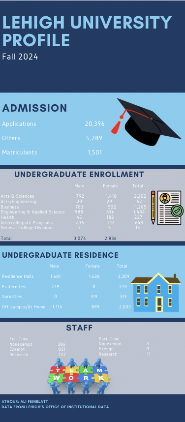
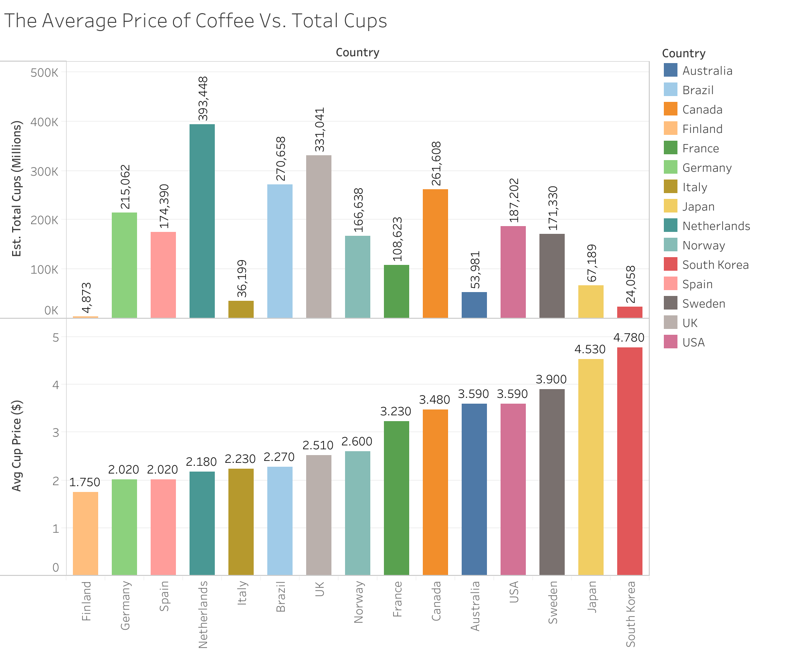

# alifeinblatt.github.io

## Self-Introduction
Hi, my name is Ali Feinblatt and I am a Sophomore at Lehigh University! I am majoring in Health, Medicine, & Society and Journalism. I am originally from New York City, and I have lived there my whole life. When I am older, I want to move back there. I have two older sisters. Carly is seven years older than me, and Rachel is five years older than me. Part of the reason I am interested in Journalism is because of Rachel. She majored in Journalism at NYU, and now writes for a magazine now. I am very impressed with her work and it inspires me to want to major in Journalism. I am also extremely interested in Health, and I am not sure what I want to do after college, whether it is health, journalism, or a mix of both!

Welcome to my [LinkedIn Page](https://www.linkedin.com/in/ali-feinblatt-5a7774295/)

## Lehigh University Fall 2024 Information

Lehigh University continues to excel in academics, student life, and community engagement. This Fall 2024 profile overviews admissions statistics, undergraduate enrollment, campus housing, and staffing data. Explore the numbers behind Lehigh’s campus experience!

## New York Knicks Statistics

Being from New York City, the New York Knicks are my favorite basketball team. So, for this project, I chose to analyze data from the season. Here is the Data for the New York Knicks in the 2024-2025 season. You can see  not only each player's statistics but the team as a whole! 

.png?raw=true)

## Here is a Timeline of the Lehigh-Lafayette Rivalry
The Lehigh-Lafayette football rivalry is the longest and most-played rivalry in college football history. The first game was in 1884, and there have been over 150 games since then. This tradition brings together generations of students, alumni, and fans on both sides. Look at this timeline to see how the rivalry has changed overtime, and amazing moments that have happened throughout history. 

<iframe 
  src="https://cdn.knightlab.com/libs/timeline3/latest/embed/index.html?source=v2%3A2PACX-1vRrZG2bFZGxB5R2WUWFQ_Mn8ZDo9PycaIEJ11KbGC7xwCZjGFHXLnzGBMhHTulcIjU5QILWoqQrSY0X&font=Default&lang=en&initial_zoom=2&height=650" 
  width="100%" 
  height="650" 
  webkitallowfullscreen 
  mozallowfullscreen 
  allowfullscreen 
  frameborder="0">
</iframe>

## Here is a Timeline of Women in Sports
Throughout history, women were not always allowed to play in various big sports matches such as the Olympics. However, women have fought their way into the sports world. Throughout various milestones, there have been many achievements made by very brace women throughout history, who were not afraid to compete in sports that they loved. 

<iframe 
  src="https://cdn.knightlab.com/libs/timeline3/latest/embed/index.html?source=v2%3A2PACX-1vRMwEbnvElfUWiakTa98BVYEKw_-rFftSNa5xpURw_21cvC2VMmW_KZdeaG2k41m3s9BNbkGFVMBI-D&font=Default&lang=en&initial_zoom=2&height=650" 
  width="100%" 
  height="650" 
  frameborder="0" 
  allowfullscreen 
  webkitallowfullscreen 
  mozallowfullscreen>
</iframe>

## Chart representing the undergraduate percentage of Lehigh Students in each college 
This bar chart shows the distribution of undergraduate students across Lehigh's colleges. The largest number of students is enrolled in the College of Arts and Sciences (CAS), then the P.C. Rossin College of Engineering, and the College of Business. However, the smallest number of students are enrolled in intercollegiate programs, and the College of Health. 

## Chart demonstrating the weather patterns in Bethlehem, PA
This line chart shows the weather patterns in Bethlehem, Pennsylvania, from March 6 to March 15. This shows that there are various fluctuations, with a rise in temperature on March 11, following colder weather patterns. This shows how unpredictable the weather is during that time. 

## Here is a Map Demonstrating the Top 20 Cycling Cities
This interactive map shows the top 20 cities around the world that are known for their bike-friendly infrastructure. These cities are safe and accessible to travel in. Explore the map to see each of these places!

<iframe src="https://www.google.com/maps/d/u/0/embed?mid=1MVsiQaBzcgR3L1MQqDgUKIc4V1KqApM&ehbc=2E312F" width="640" height="480"></iframe>

## Here is a Map Showing the Top 10 Cities with the Best Public Transportation Systems in the United States
This map shows the top 10 U.S. cities with the most efficient, reliable, and accessible public transportation systems. New York City has the best public transportation because of the subway which connects all five boroughs. Explore each of these places and why their public transportation is so great!
<iframe src="https://www.google.com/maps/d/u/0/embed?mid=1gQNfmHhAEljglkRdMRPFHcLsq1P7tK0&ehbc=2E312F" width="640" height="480"></iframe>

## Coffee Price vs. Total Cups in Various Countries 
Here is a chart showing the coffee price in various countries, and the number of cups of coffee that those countries drink in millions. As you can see, there is not much of a correlation between the price and the number of cups of coffee. It is crazy to compare the most expensive country to the least expensive, when they are both selling coffee!

